---
# generate the slideshow:
# pandoc -t revealjs -s passwords.md -o passwords.html
# or
# pandoc -t beamer -s passwords.md -o passwords.pdf
title: Les mots de passe
subtitle: ...ou comment s'en débarasser
author: Morgan Courbet
date: 25 septembre 2019

# reveal.js specific variables
# https://github.com/hakimel/reveal.js#configuration
center: 'true'
#parallaxBackgroundImage: 'https://s3.amazonaws.com/hakim-static/reveal-js/reveal-parallax-1.jpg'
# parallaxBackgroundHorizontal: 100
# parallaxBackgroundVertical: 100
showNotes: 'false'
slideNumber: 'true'
# reveal.js themes: beige, black, blood, league, moon, night, serif, simple, sky, solarized, white
theme: 'league'
# transition none/fade/slide/convex/concave/zoom
# transition: 'slide'

# beamer specific variables
#aspectratio: 169
#beameroption: 
# beamer themes: http://www.deic.uab.es/~iblanes/beamer_gallery/
# beamer themes: AnnArbor Antibes Bergen Berkeley Berlin Boadilla boxes CambridgeUS Copenhagen Darmstadt default Dresden Frankfurt Goettingen Hannover Ilmenau JuanLesPins Luebeck Madrid Malmoe Marburg Montpellier PaloAlto Pittsburgh Rochester Singapore Szeged Warsaw
#theme: berlin
# beamer color theme: albatross beaver beetle crane default dolphin dove fly lily orchid rose seagull seahorse sidebartab structure whale wolverine
#colortheme: lily
# beamer font themes: default professionalfonts serif structurebold structureitalicserif structuresmallcapsserif
#fonttheme: default
#navigation: vertical
---

# Histoire

## "Sésame, ouvre-toi !"

::: notes
-  Baba et les 40 Voleurs, 1001 nuits, Antoine Galland, 1701
:::

## ubisoft.com

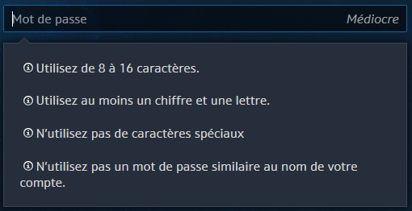

## ameli.fr

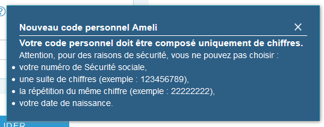

::: notes
Chiffres uniquement
:::

## caisse-epargne.fr

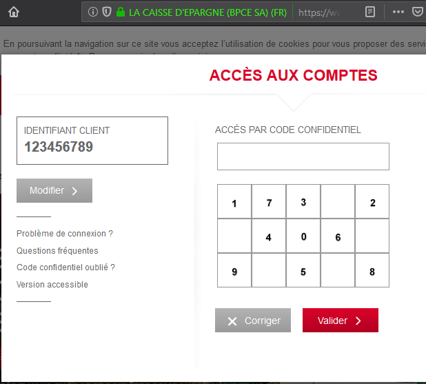

::: notes
Clavier visuel
:::

# Les mots de passe sont un problème

## Compliqués à retenir

::: notes
- majuscule ?
- point d'exclamation au début ?
- j'avais remplacé ce `A` par un `4` ?
:::

## Pénibles à saisir

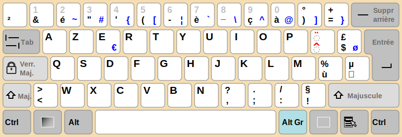

# Conséquence

## Mots de passe faibles

:::::::::::::: {.columns}
::: {.column width="45%"}
complexité à retenir \
+ \
pénibilité à saisir \
+ \
(humains fainéants)
:::

::: {.column width="10%"}
=
:::

::: {.column width="45%"}
mots de passe faible
:::
::::::::::::::

## Liste des mots de passe les plus utilisés en 2018

1. `123456`
2. `password`
3. `123456789`
4. `12345678`
5. `12345`

_Source: <https://gizmodo.com/the-25-most-popular-passwords-of-2018-will-make-you-fee-1831052705>_

## Mots de passe faillibles

<!-- ::: incremental -->
- Méthodes de capture variées
- Secret partagé
- Réutilisation
- Difficulté de se souvenir d'un nouveau mot de passe
<!-- ::: -->

::: notes
- Espionnage direct du clavier
- Keylogger
- Force brute
- Ecoute du réseau non chiffré
- Vol de mot de passe manuscrit
:::

## Conséquence

- Vol d'identité
- Vol d'argent
- Fuite d'informations médicales
- etc.

## "Ça n'arrive qu'aux autres"

- FAUX !
- Faites le test sur <https://haveibeenpwned.com/>

# Solution

##

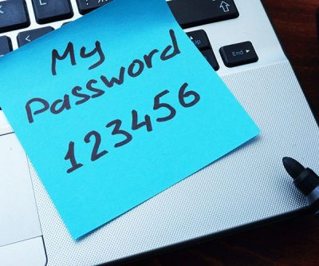

::: notes
- se perd
- se vole
- n'est pas sécurisé
:::

## Une meilleure solution : le gestionnaire de mots de passe

- Fonctionnalités principales
  - Stocke les mots de passe
  - Sécurisé
  - Protégé par un mot de passe **fort**
  - Génère des mots passe longs et forts
    - Exemple : `H}eb<)5)F[fXb!(#"hVa-`

## Gestionnaire de mots de passe

- Fonctionnalités accessoires
  - Synchronisation entre plusieurs appareils
  - Remplissage automatique des formulaires
  - Partage de mot de passe (conjoint·e)
  - Changement de mot de passe en un clic

## Quelques gestionnaires

- Propriétaire et payant
  - [Dashlane](https://www.dashlane.com/) (🇫🇷 🐓 ❕)
  - [1Password](https://1password.com/)
  - [LastPass](https://www.lastpass.com/)
- Libre et gratuit
  - [KeePassXC](https://keepassxc.org/) : base hors-ligne, synchronisable avec Syncthing, Dropbox, Google Drive, etc. (hautement recommandé 👍)
  - [Bitwarden](https://bitwarden.com/) : auto-hébergement

## Démonstration

# Encore plus sécurisé

## Two-factor authentication (2FA)

- Demande un deuxième élément d'identification, en plus du mot de passe
- Parade contre le vol de mot de passe

::: notes
- parade
  - HTTP au lieu de **HTTPS**
  - DB de mots de passe
- Deux standards
  - One-time password (OTP)
  - Universal 2nd Factor (U2F)
:::

## One-time Password (OTP)

:::::::::::::: {.columns}
::: {.column width="25%"}
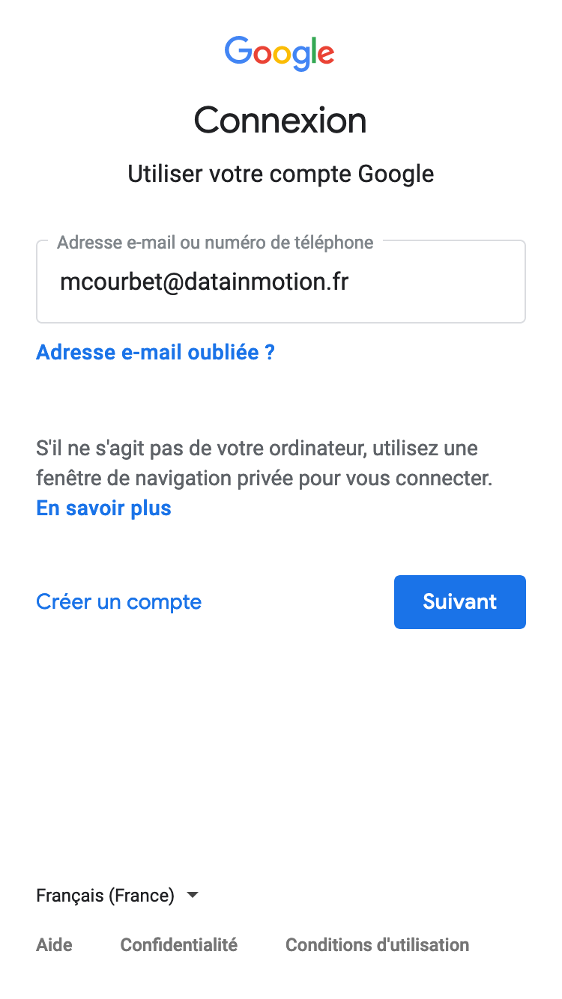
:::

::: {.column width="25%"}
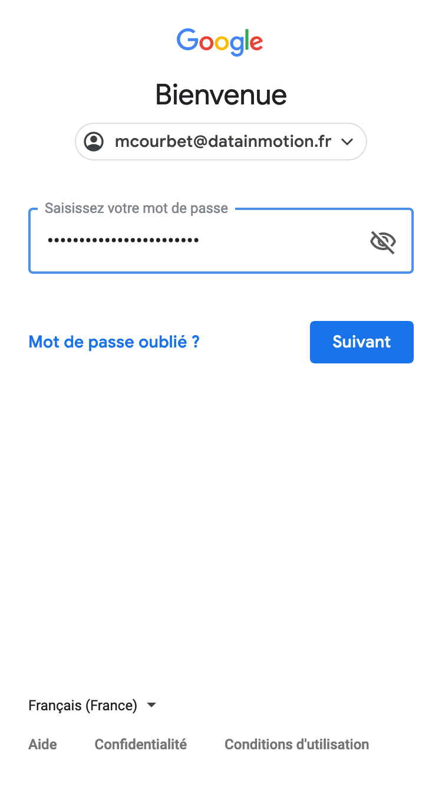
:::

::: {.column width="25%"}
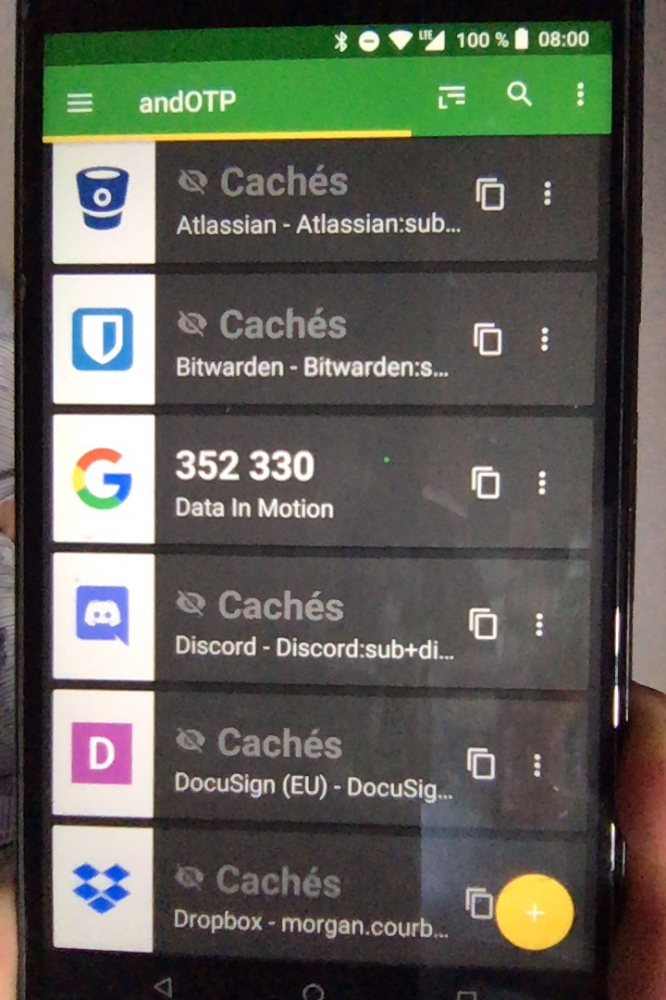
:::

::: {.column width="25%"}
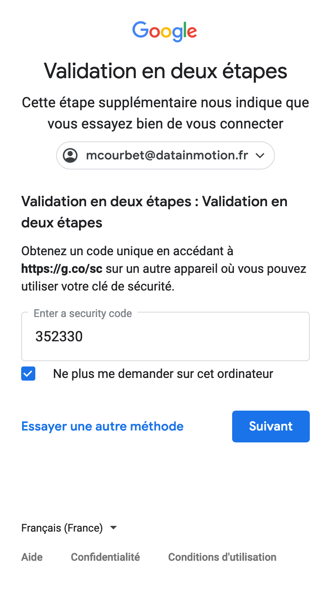
:::
::::::::::::::

::: notes
- Standard depuis au moins 7 ans
- Implémenté par :
  - Les acteurs majeurs : Google, Facebook, Dropbox, Paypal, Amazon, Microsoft, GitHub, Twitter, etc.
  - ...et de moins grands : Gandi, Electronic Arts, Synology, TeamViewer, Trello, Reddit, KickStarter, etc.
:::

## Universal 2nd Factor (U2F)

:::::::::::::: {.columns}
::: {.column width="25%"}

:::

::: {.column width="25%"}

:::

::: {.column width="25%"}
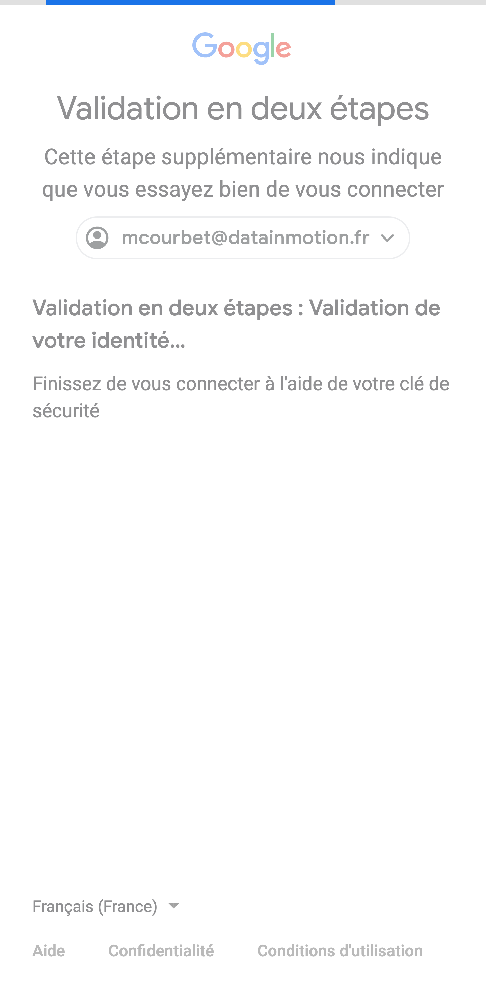
:::

::: {.column width="25%"}
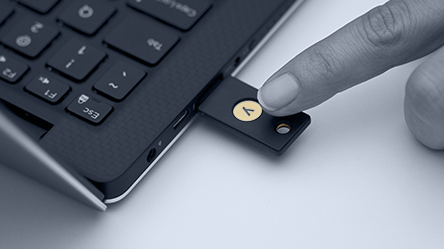
:::
::::::::::::::

::: notes
- Jeton physique (clé USB)
- Hautement sécurisé, et + facile à utiliser
- Commence à être implémenté : Google, Facebook, Microsoft, GitHub
:::

# Questions

## 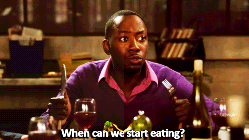

<!-- ## Idées

- liste des pires mdp
- haveibeenpwnd / zxcvbn
- https://blog.codinghorror.com/password-rules-are-bullshit/ -->

<!-- incremental slides
::: incremental

- one
- two
- three

::: -->

<!-- presenter notes
::: notes

This is my note.
- It can contain Markdown
- like this list

::: -->
